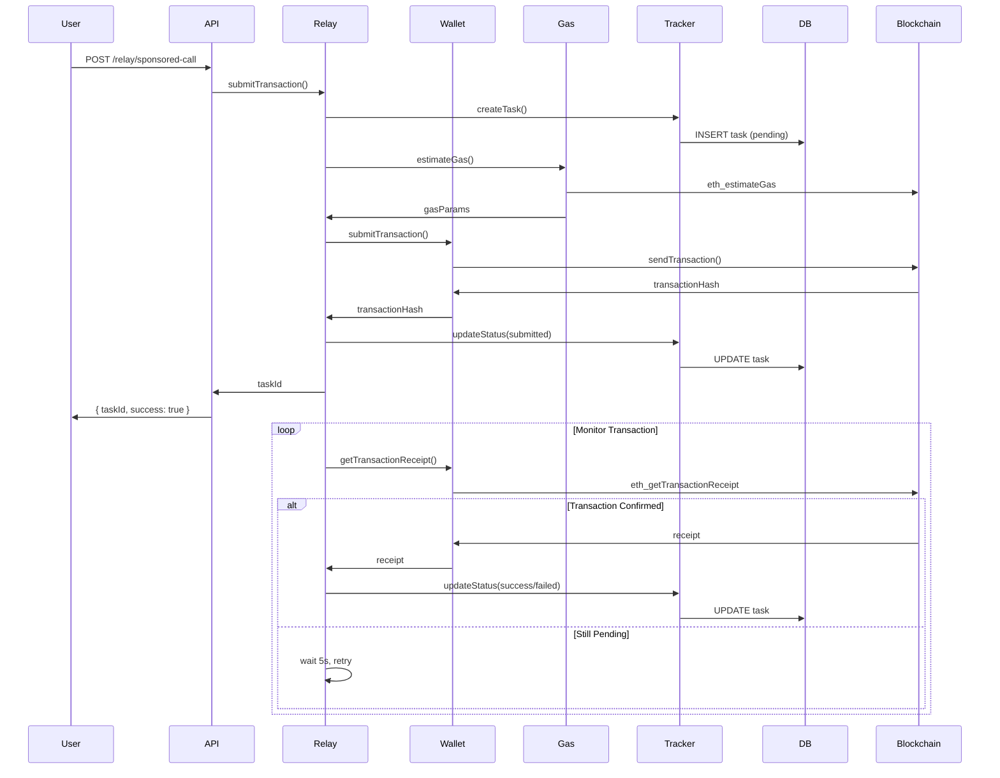

# Coffea Relay Service Architecture

## Overview

The Coffea Relay Service is a custom blockchain transaction relay service designed as a cost-effective alternative to Gelato Network. It provides gasless transaction execution for DeFi strategies while maintaining full control over gas optimization and transaction handling.

## System Architecture

```
┌─────────────────────────────────────────────────────────────┐
│                    Coffea Relay Service                     │
├─────────────────────────────────────────────────────────────┤
│  ┌─────────────┐  ┌─────────────┐  ┌─────────────┐         │
│  │    API      │  │   Health    │  │  Swagger    │         │
│  │ Controller  │  │ Controller  │  │    Docs     │         │
│  └─────────────┘  └─────────────┘  └─────────────┘         │
├─────────────────────────────────────────────────────────────┤
│  ┌─────────────┐  ┌─────────────┐  ┌─────────────┐         │
│  │   Relay     │  │   Wallet    │  │ Gas Estim.  │         │
│  │  Service    │  │  Service    │  │  Service    │         │
│  └─────────────┘  └─────────────┘  └─────────────┘         │
│                    ┌─────────────┐                         │
│                    │ Task Track. │                         │
│                    │  Service    │                         │
│                    └─────────────┘                         │
├─────────────────────────────────────────────────────────────┤
│  ┌─────────────┐  ┌─────────────┐  ┌─────────────┐         │
│  │ PostgreSQL  │  │    Redis    │  │  TypeORM    │         │
│  │ Database    │  │   Cache     │  │   Entities  │         │
│  └─────────────┘  └─────────────┘  └─────────────┘         │
├─────────────────────────────────────────────────────────────┤
│  ┌─────────────┐  ┌─────────────┐  ┌─────────────┐         │
│  │  Ethereum   │  │   Sepolia   │  │   Hardhat   │         │
│  │  Mainnet    │  │  Testnet    │  │    Local    │         │
│  └─────────────┘  └─────────────┘  └─────────────┘         │
└─────────────────────────────────────────────────────────────┘
```

## Core Components

### 1. API Layer

#### RelayController
- **Purpose**: HTTP endpoints for transaction submission and monitoring
- **Endpoints**:
  - `POST /api/relay/sponsored-call` - Submit gasless transactions
  - `GET /api/relay/status/:taskId` - Monitor transaction status
  - `DELETE /api/relay/cancel/:taskId` - Cancel pending transactions
- **Features**: Input validation, error handling, Swagger documentation

#### HealthController
- **Purpose**: Service monitoring and diagnostics
- **Endpoints**:
  - `GET /api/health` - Basic health status
  - `GET /api/health/detailed` - Component-level health details
- **Monitors**: Database, RPC providers, wallet, gas estimator

### 2. Business Logic Layer

#### RelayService
- **Purpose**: Main orchestration and transaction lifecycle management
- **Responsibilities**:
  - Transaction validation and preprocessing
  - Service coordination (wallet, gas, tracking)
  - Asynchronous transaction monitoring
  - Error handling and retry logic
- **Features**: Multi-chain support, comprehensive logging

#### WalletService
- **Purpose**: Blockchain interaction and transaction signing
- **Responsibilities**:
  - Private key management and transaction signing
  - RPC provider management for multiple chains
  - Transaction submission and receipt retrieval
  - Gas estimation and validation
- **Security**: Secure key handling, transaction validation

#### GasEstimatorService
- **Purpose**: Intelligent gas price calculation and optimization
- **Responsibilities**:
  - Real-time gas price fetching from multiple sources
  - EIP-1559 support detection and configuration
  - Gas limit estimation with safety buffers
  - Price caching for performance optimization
- **Features**: Multi-speed pricing (slow/standard/fast), validation

#### TaskTrackerService
- **Purpose**: Transaction persistence and status management
- **Responsibilities**:
  - Database operations for task CRUD
  - Status updates throughout transaction lifecycle
  - User transaction history and analytics
  - Task cleanup and maintenance
- **Features**: Indexed queries, comprehensive metadata storage

### 3. Data Layer

#### RelayTask Entity
- **Purpose**: Core data model for transaction tracking
- **Fields**:
  - Task identification (UUID, timestamps)
  - Transaction parameters (chain, target, data, gas)
  - Status tracking (pending → submitted → success/failed)
  - Result metadata (hash, block, gas used, errors)
- **Indexing**: Optimized for user queries, status lookups, chain filtering

#### Database Configuration
- **Primary**: PostgreSQL for transaction persistence
- **Cache**: Redis for gas price caching and performance
- **ORM**: TypeORM with migrations and environment-based config
- **Features**: Connection pooling, SSL support, automatic migrations

## Transaction Flow



## Multi-Chain Support

### Supported Networks
1. **Ethereum Mainnet (Chain ID: 1)**
   - Production DeFi transactions
   - High gas costs, EIP-1559 support
   - Comprehensive protocol coverage

2. **Sepolia Testnet (Chain ID: 11155111)**
   - Testing and development
   - Free test ETH for gas
   - Identical API behavior to mainnet

3. **Hardhat Local (Chain ID: 31337)**
   - Local development and testing
   - Instant transactions, no gas costs
   - Fork testing capabilities

### Chain Configuration
- **RPC Endpoints**: Environment-configurable for each chain
- **Gas Strategies**: Chain-specific optimization (legacy vs EIP-1559)
- **Provider Management**: Automatic failover and health monitoring
- **Chain Detection**: Automatic protocol and feature detection

## Security Considerations

### Private Key Management
- **Storage**: Environment variables with secure key rotation
- **Access**: Single service instance, no key sharing
- **Validation**: Address verification and balance monitoring
- **Recommendations**: Hardware wallets for production, key encryption

### Transaction Validation
- **Input Sanitization**: Comprehensive parameter validation
- **Gas Limits**: Maximum gas limits to prevent abuse
- **Rate Limiting**: API request limits and user quotas
- **Chain Validation**: Ensure target contracts exist and are valid

### Database Security
- **Connection**: SSL/TLS encryption for all connections
- **Access Control**: Database user with minimal required permissions
- **Data Privacy**: User addresses stored securely, no sensitive data
- **Backup**: Regular encrypted backups with retention policies

## Performance Optimization

### Caching Strategy
- **Gas Prices**: 60-second TTL for real-time pricing
- **Chain Data**: 5-minute TTL for block numbers and network info
- **Provider Health**: Health status caching to avoid repeated checks
- **User Queries**: Query result caching for transaction history

### Database Optimization
- **Indexing**: Strategic indexes on query patterns
  - `(user, createdAt)` for user transaction history
  - `(chainId, status)` for chain-specific monitoring
  - `(transactionHash)` for receipt lookups
- **Connection Pooling**: Optimized connection management
- **Query Optimization**: Efficient queries with LIMIT and pagination

### Monitoring and Observability
- **Health Checks**: Multi-level health monitoring
- **Logging**: Structured logging with correlation IDs
- **Metrics**: Transaction volume, success rates, gas costs
- **Alerting**: Automated alerts for service degradation

## Scalability Considerations

### Horizontal Scaling
- **Stateless Design**: All state in database, no in-memory state
- **Load Balancing**: Multiple service instances behind load balancer
- **Database Scaling**: Read replicas for query scaling
- **Cache Scaling**: Redis cluster for cache scaling

### Vertical Scaling
- **Memory**: Efficient memory usage with garbage collection tuning
- **CPU**: Asynchronous processing for non-blocking operations
- **I/O**: Connection pooling and batch operations
- **Storage**: SSD storage for database performance

## Deployment Architecture

### Production Setup
```
┌─────────────────┐    ┌─────────────────┐    ┌─────────────────┐
│  Load Balancer  │    │  Load Balancer  │    │  Load Balancer  │
│   (Primary)     │    │   (Secondary)   │    │   (Backup)      │
└─────────────────┘    └─────────────────┘    └─────────────────┘
         │                       │                       │
    ┌────────────────────────────────────────────────────────┐
    │                Service Instances                       │
    ├─────────────┬─────────────┬─────────────┬─────────────┤
    │  Instance 1 │ Instance 2  │ Instance 3  │ Instance N  │
    └─────────────┴─────────────┴─────────────┴─────────────┘
                                  │
    ┌─────────────────────────────────────────────────────────┐
    │                    Data Layer                           │
    ├─────────────────┬─────────────────┬─────────────────────┤
    │ PostgreSQL      │ Redis Cache     │ Monitoring          │
    │ Primary/Replica │ Cluster         │ Prometheus/Grafana  │
    └─────────────────┴─────────────────┴─────────────────────┘
```

### Environment Configuration
- **Development**: Single instance, local database, debug logging
- **Staging**: Multi-instance, shared database, performance testing
- **Production**: Full HA setup, monitoring, automated deployments

## Error Handling and Recovery

### Error Categories
1. **User Errors**: Invalid parameters, insufficient gas
2. **Network Errors**: RPC failures, connectivity issues
3. **Blockchain Errors**: Transaction reverts, network congestion
4. **System Errors**: Database issues, service failures

### Recovery Strategies
- **Automatic Retry**: Configurable retry logic with exponential backoff
- **Circuit Breaker**: Prevent cascade failures with service isolation
- **Graceful Degradation**: Fallback to basic functionality during issues
- **Manual Recovery**: Admin tools for transaction recovery and debugging